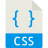
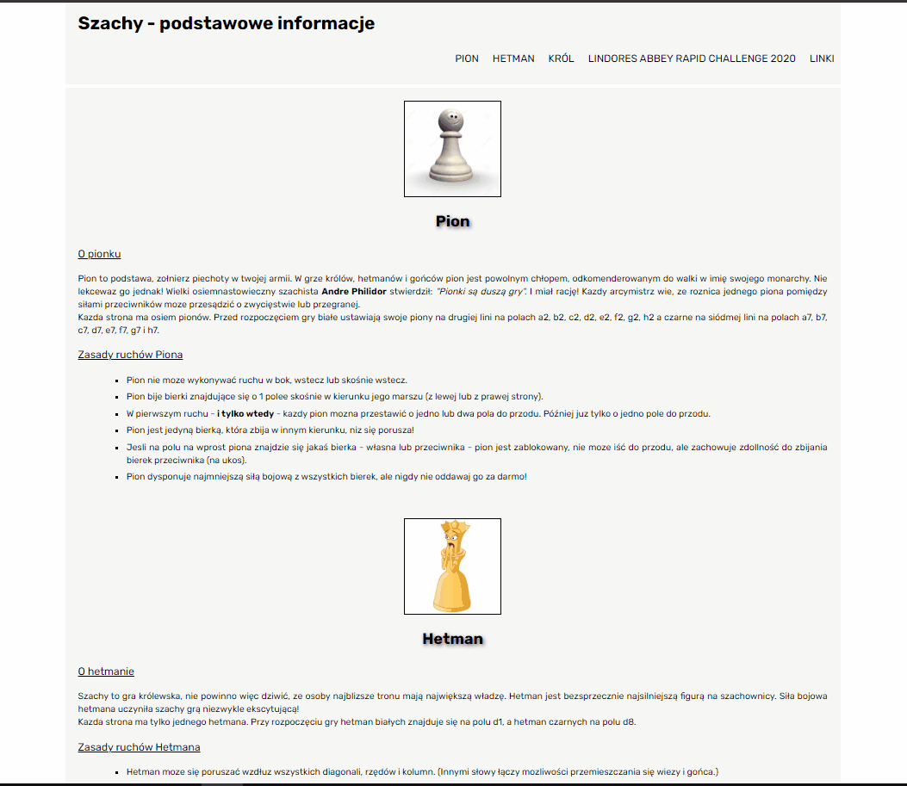

# Homepage

#### First steps in coding and programming

## DEMO

https://jerszynski.github.io/homepage/

---

#### Languages used in project:

 

  

---

- Welcome to my first page on which I'm showing you some basics information of Chess pieces.  
  You will find short info about Pawn, King and Queen in Polish language. 
  Also you can find two button to check my small interaction with a website.
   
   

- Below is quick look on website: 

